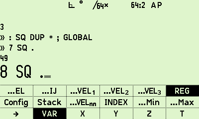
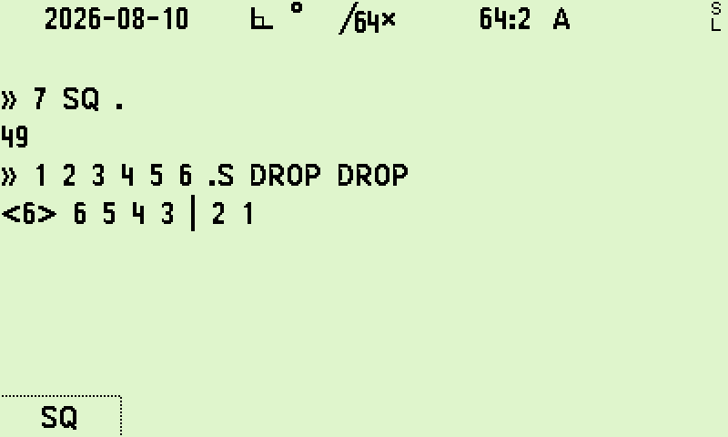
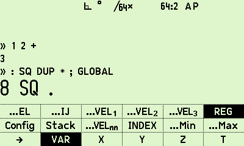
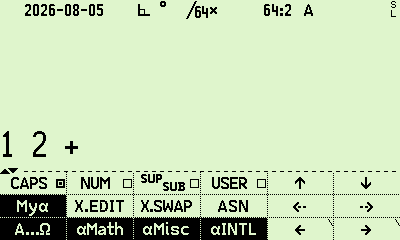
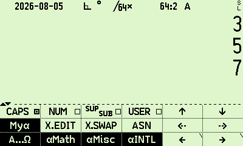
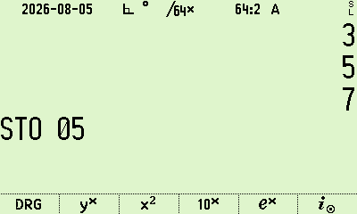
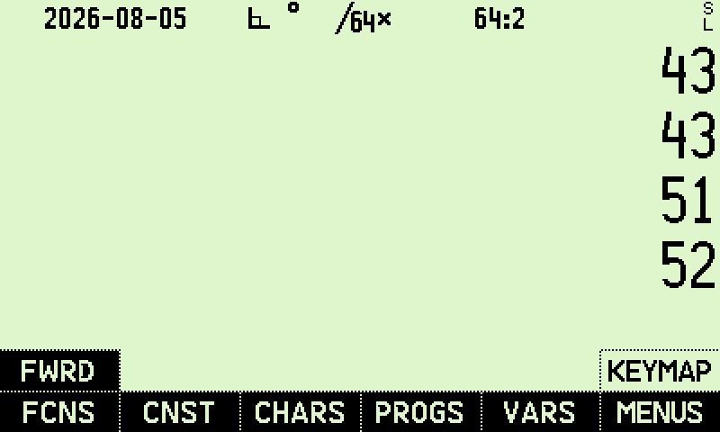
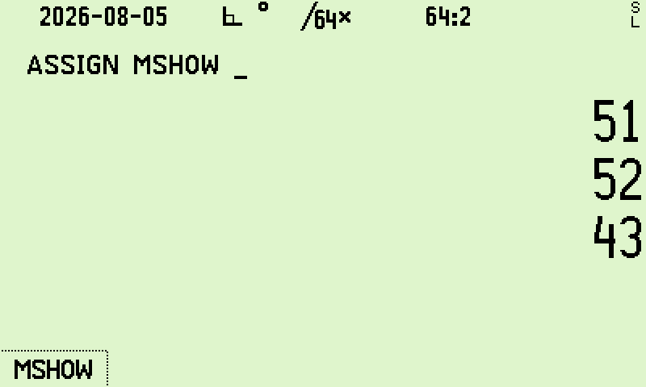
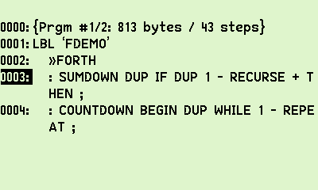
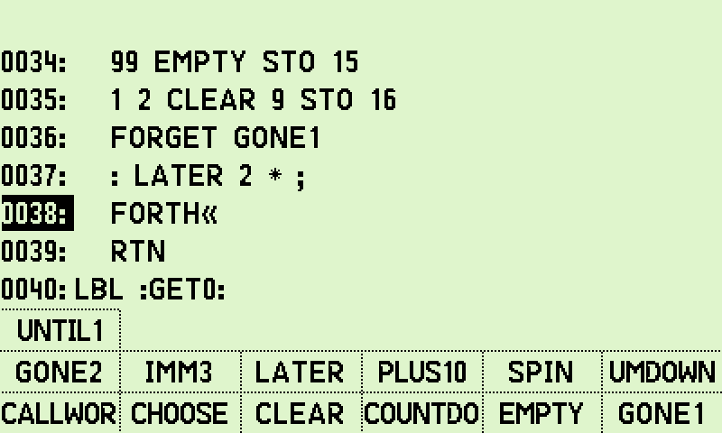

# R47 Forth

Forth for the C47 calculator, running on the DM42n (DMCP5).
Built as a package on top of the [C47 firmware](https://gitlab.com/rpncalculators/c43).

The Forth data stack is the calculator's RPN stack (4 or 8 registers, depending on SSIZE8) plus an arena-backed spill region that gives you unlimited depth for mid-line computation. `.S` shows the full picture with a `|` separator at the spill boundary.

## Screenshots

### Console

The interactive console takes over the stack area. Output words write to the transcript, input sits at the bottom.



`.S` shows the full stack. The `|` separates register values from spilled values:



The transcript rolls upward as you work:



### Interactive REPL

FORTH outside PEM opens a capture on the normal screen. ENTER runs the line, EXIT closes.



After execution, the stack shows the results:



### Keys mode and fold

The ALPHA gesture toggles between alpha and calculator-key input. Parameterized keys fold their canonical spelling into the line:



### Catalog and ASSIGN

FWRD appears in the catalog tree under FCNS:



Global Forth words can be ASSIGNed to user keys:



### PEM listing

Forth source lives inside normal R47 programs as program steps:



The FWRD picker lists words visible to the current program:



## Forth word reference

### Stack manipulation

| Word | Effect | Description |
|------|--------|-------------|
| `DUP` | +1 | Duplicate X. |
| `DROP` | -1 | Discard X. |
| `SWAP` | 0 | Exchange X and Y. |
| `OVER` | +1 | Copy Y on top of the stack. |

### Arithmetic

| Word | Effect | Description |
|------|--------|-------------|
| `+` | -1 | Y + X. |
| `-` | -1 | Y - X. |
| `*` | -1 | Y * X. The `×` and `·` glyphs work too. |
| `/` | -1 | Y / X. The `÷` glyph works too. |

### Console output

| Word | Effect | Description |
|------|--------|-------------|
| `.` | -1 | Print X in the current display format, then DROP. |
| `.S` | 0 | Non-destructive stack dump. Prints `<depth>` then every value. A `\|` separates register values from spilled values. |
| `.$` | -1 | Print the string in X as text, then DROP. Type error if X isn't a string. |
| `EMIT` | -1 | Print X as a C47 glyph code, then DROP. |
| `CR` | 0 | Newline. |
| `SPACE` | 0 | Single space. |
| `PAGE` | 0 | Clear the console view. History stays intact. |

### Definitions

| Word | Effect | Description |
|------|--------|-------------|
| `:` | 0 | Start a colon definition. Reads the next token as the word name. |
| `;` | 0 | End a colon definition. |
| `RECURSE` | 0 | Compile a self-call. Only works inside a definition. |
| `GLOBAL` | 0 | Move the last closed definition to the global dictionary, so it survives power cycles. |
| `IMMEDIATE` | 0 | Mark the last closed definition as immediate. It'll execute during compilation. |
| `FORGET` | 0 | Remove a word (and everything after it) from the global dictionary. Reads the next token as the name. |

### Control flow

All of these are compile-only. They emit branch tokens into the word you're defining.

| Word | Description |
|------|-------------|
| `IF` | Pop X; branch forward if zero. |
| `ELSE` | Branch to `THEN`, patching the `IF`. |
| `THEN` | Resolve the forward branch from `IF` or `ELSE`. |
| `BEGIN` | Mark a loop target. |
| `UNTIL` | Pop X; loop back to `BEGIN` if zero (loop while false). |
| `AGAIN` | Unconditional loop back to `BEGIN`. |
| `WHILE` | Pop X; exit a `BEGIN`..`REPEAT` loop if zero. |
| `REPEAT` | Loop back to `BEGIN`; resolve `WHILE`. |

Patterns:

```forth
: ABS-DIFF  - DUP 0 < IF CHS THEN ;

: COUNT-DOWN  BEGIN DUP . 1 - DUP 0 = UNTIL DROP ;

: RUN  BEGIN RCL 19 WHILE STEP REPEAT ;
```

### Execution

| Word | Description |
|------|-------------|
| `XEQ` | Execute by name. `XEQ 'NAME'` for globals, `XEQ :NAME:` for locals. |

### Calculator functions

Every C47 calculator function is callable by its catalog name. The interpreter resolves these after checking primitives, user words, then number literals.

| Syntax | Examples |
|--------|---------|
| `FUNC` | `SIN`, `COS`, `ABS`, `SQRT`, `LN`, `EXP`, `CHS`, `IP`, `FP`, `x!`, `CLSTK` |
| `STO n` | `STO 00`..`STO 99`, `STO A`..`STO W`, `STO 'name'`, `STO .00`..`.98` (local), `STO →nn` (indirect) |
| `RCL n` | Same parameter forms as `STO`. |
| `STO+ n` | Arithmetic store. `STO+`, `STO-`, `STO×`, `STO÷`. Same parameter forms. |
| `SF n` / `CF n` | Set/clear flag. `SF 00`..`SF 99`, `SF A`, `SF 'SYSFLAG'`, dot-flags for locals. |
| `FS? n` / `FC? n` | Test flag. Pushes 1 or 0. |
| `x<` / `x=` / `x>` | Comparison tests against Y. Push 1 (true) or 0 (false). |
| `SHUFFLE xyzt` | Stack reorder with 4 chars from `{x,y,z,t}`. |

Items that control C47 program flow (`END`, `RTN`, `STOP`, `GTO`, `CASE`) are rejected.

### Token resolution order

When the interpreter sees a token, it tries these in order. First match wins.

| # | Lookup | Matches |
|---|--------|---------|
| 1 | Structural words | `:` `;` `FORGET` `XEQ` |
| 2 | Primitive table | The 29 built-in Forth words listed above |
| 3 | User-defined words | Colon definitions in the transient or global dictionary |
| 4 | Number literal | `42`, `3.14`, `-7` |
| 5 | C47 zero-param item | `SIN`, `ABS`, `CLSTK`, etc. |
| 6 | C47 parameterized item | `STO 20`, `RCL 'X'`, `SF 10`, etc. |
| 7 | Global program label | Bare label name (interpret state only) |
| 8 | Error | Undefined word |

## Links

- [C47 upstream](https://gitlab.com/rpncalculators/c43)
- [C47 Wiki](https://gitlab.com/rpncalculators/c43/-/wikis/home)
- [47calc.com](https://47calc.com) (bezels and documentation)
