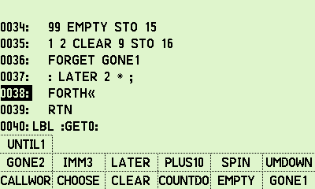
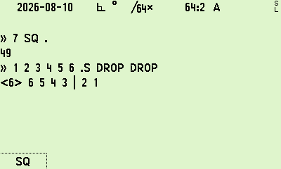
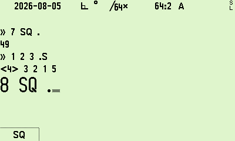

# forth-core

This archive contains the `forth-core` package. It adds an interactive Forth programming environment, compiler, and dictionary to R47 and C47 firmware.

Forth code lives directly inside normal R47 programs as program steps. The interpreter also executes Forth strings from the X register. The calculator's RPN stack functions directly as the Forth data stack.

The package runs alone. It has no dependency on a sibling package.

## Scope and capabilities

- **Program steps**: Insert Forth code inside R47 programs using Program Entry Mode (PEM).
- **Interactive execution**: Execute Forth code directly from string values in the X register.
- **RPN stack integration**: Forth words read and push calculator values directly on the stack.
- **Stack spill**: Calculations deeper than the visible stack spill to memory and return as words unwind.
- **Dictionary scoping**: Definitions are program-local by default. The `GLOBAL` keyword promotes words to the global dictionary.
- **C47 interoperability**: Forth code can execute native C47 calculator functions with parameter grammar. R47 programs can execute Forth words with `XEQ`.

## Program entry mode (PEM)

To write Forth code in a program:

1. Enter Program Entry Mode (PEM).
2. Insert `FORTH`. The alpha editor opens, and the closing marker is inserted automatically.
3. Type Forth code on the line. Press `ENTER` to store the line and advance inside the block.
4. Press `EXIT` to close the editor.

The line is verified before it is stored. If a line contains invalid syntax, the editor refuses the line to protect program memory.


*Figure 1: Program Entry Mode listing showing the Forth block marker and colon definitions.*

## Dictionary scoping

- **Program-local by default**: A word defined inside a program is visible only to that program. Two separate programs can define words with identical names without collision.
- **Pre-scanning**: Words defined anywhere within a program block are pre-scanned, so words can be called above their line of definition.
- **Global promotion**: Precede a definition with `GLOBAL` to make it accessible across all programs, the keyboard catalog, and power cycles:
  ```forth
  GLOBAL : CUBE DUP DUP * * ;
  ```

## Core word set

### Stack manipulation
`DUP`, `DROP`, `SWAP`, `OVER`, `ROT`, `?DUP`, `NIP`, `TUCK`, `2DUP`, `2DROP`, `2SWAP`, `2OVER`

### Arithmetic and logic
`+`, `-`, `*`, `/`, `MOD`, `/MOD`, `1+`, `1-`, `ABS`, `NEGATE`, `MIN`, `MAX`, `AND`, `OR`, `XOR`, `INVERT`

### Comparison
`=`, `<>`, `<`, `>`, `<=`, `>=`, `0=`, `0<>`, `0<`, `0>`

### Control flow
- `IF ... THEN`
- `IF ... ELSE ... THEN`
- `BEGIN ... UNTIL`
- `BEGIN ... AGAIN`
- `BEGIN ... WHILE ... REPEAT`

### Compiler words
`: ... ;`, `GLOBAL`, `IMMEDIATE`, `RECURSE`, `FORGET`, `'`

### System and stack inspection
- `.S`: Prints the current stack values and any spilled values.
- `WORDS`: Displays words defined in the current scope.
- `FWRD`: Opens a catalog of available Forth words and inserts the selection at the cursor.



*Figure 2: The `FWRD` word picker softmenu showing defined Forth words.*

## Install and build

Build the simulator with Forth active:

```sh
make sim CUSTOM_PKG=packages/forth-core
```

Build for DMCP5 hardware (DM42n):

```sh
make dist_dmcp5r47 CUSTOM_PKG=packages/forth-core
```

Run the package test suite:

```sh
./packages/forth-core/build-test.sh
```

## Example: factorial with recursion

Store this definition in a program:

```forth
: FACT ( n -- n! )
  DUP 2 < IF
    DROP 1
  ELSE
    DUP 1- RECURSE *
  THEN ;
```

Enter `7` on the stack and execute `FACT`. The stack displays `5040`.

Values past the visible stack window spill into memory automatically and restore as the word finishes execution.



*Figure 3: The `.S` command showing stack contents and the spill boundary separator `|`.*

## Interactive execution

Forth code can execute interactively. Place a Forth string in the X register or run words in the console:



*Figure 4: Interactive Forth execution and stack inspection in the console dialogue.*

## Example: calling C47 functions

Forth words can call native calculator functions using `XEQ` and parameter grammar:

```forth
XEQ 'SIN'       \ runs sine on the value in X
XEQ 'RCL' 01    \ recalls register 01 to X
```

## System limits

- Return stack capacity: 64 levels
- Runaway execution guard: 4,096 cycles
- Source line buffer: 256 bytes
- Maximum word name length: 31 characters
- Definition nesting limit: 4 levels
- Data stack: Native 4-level or 8-level RPN stack

## Compatibility and license

The package targets R47 and C47 on DM42n hardware with DMCP5. It is licensed under GPL-3.0-only.
