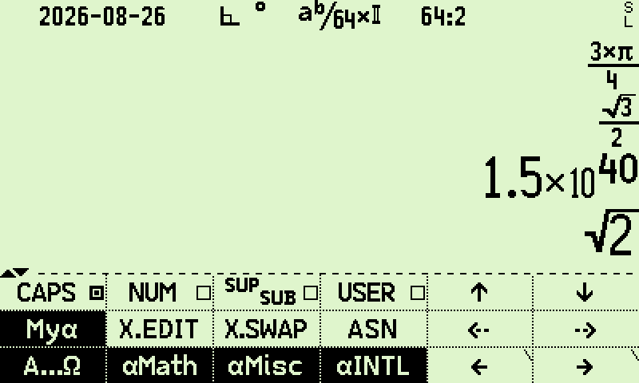
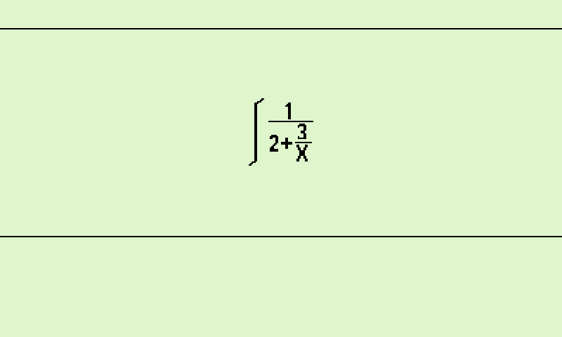

# pretty-print core

This archive contains only the `pretty-print` core package. It adds two-dimensional natural display.

The core draws supported values and native equations. It can also draw stored RPN programs.

The package runs alone. It has no dependency on a sibling package.

## Core scope

The core package provides these functions:

| Function | Use |
| --- | --- |
| `PPON` | Toggle automatic natural display. The `PPRTY` system flag stores this setting. The default is on. |
| `PSHOW` | Draw the value in X on the full screen. It uses the largest layout that fits. |
| `EQSHW` | Draw the current native equation on the full screen. |
| `VISUAL` | Draw the mathematics of a stored RPN program without running the program. |
| `PTLIN` | Toggle the `PTLINE` system flag. This flag has no visible effect in a core-only build. |

The core package has no `PP` softmenu. Open the function catalog. Select the core functions there.

`PPRTY` and `PTLINE` also appear in the system-flag catalog. `PSHOW` and `EQSHW` work when `PPRTY` is clear.

The core package does not include these features:

- Formula capture
- Formula history
- `PHIST` or `PCLR`
- A live formula on the T line
- The `SUM`, `PROD`, `INTEG`, or `DERIV` equation syntax

Those features belong to `pretty-print-extra`.

## Install

Run these commands from the root of the c43 source tree:

```sh
mkdir -p packages/pretty-print
unzip pretty-print.zip -d packages/pretty-print
```

Build the R47 simulator:

```sh
make simr47 CUSTOM_PKG=packages/pretty-print
```

Build the C47 simulator:

```sh
make sim CUSTOM_PKG=packages/pretty-print
```

Build the R47 image for DMCP5:

```sh
make dmcp5r47 CUSTOM_PKG=packages/pretty-print
```

## Example: show a stacked fraction

Enable the calculator's fraction display. Then enter this value:

```text
0.75
```

The stack shows a stacked `3/4` while `PPRTY` is set. Select `PSHOW` to draw the fraction on the full screen.

Select `PPON` to return to the stock inline display. Select `PPON` again to restore natural display.



*Figure 1: Two-dimensional natural fraction display on stack registers.*

## Example: show a native equation

Create this equation in EQN:

```text
1/(2+3/4)
```

Select the equation. Then select `EQSHW` from the function catalog.

The full-screen view draws both fractions with horizontal bars.



*Figure 2: Full-screen two-dimensional equation view (`EQSHW`).*

Press `EXIT` to close the view.

## Example: inspect an RPN program

Store this program under the global label `SQUARE`:

```text
LBL 'SQUARE'
RCL 'a'
ENTER
×
RTN
```

Return to normal mode.

1. Select `VISUAL`.
2. Enter `SQUARE`.
3. Press `ENTER`.

`VISUAL` draws `a × a` in the Z/T area. It does not run the program. The value in X does not change.

## Fallback behavior

The automatic renderer changes the screen only when it can draw the value correctly. Otherwise, the stock display remains in use.

These objects use the stock display:

- Strings
- Matrices
- Dates
- Times
- Configurations
- Long integers
- Short integers
- Plain decimal values

`PSHOW` uses the normal `SHOW` view when it cannot draw X. `EQSHW` uses a linear equation when the two-dimensional form does not fit.

`VISUAL` reports an error when it cannot express a program as static mathematics. It never runs the program to create a picture.

HP stack layout uses the stock value display.

## Compatibility and license

The package targets R47 or C47 on DM42n with DMCP5. It uses c43 commit `70f8b7db7425422ec80e0342e627ed3e2cfd71a6` as its patch base.

The package uses GPL-3.0-only. The archive includes `COPYING`.
